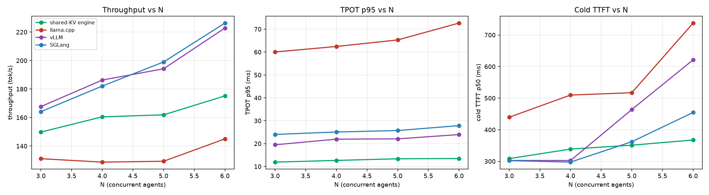
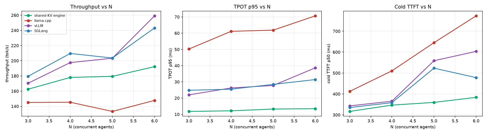

# AgentServe Reproduction

**Single-engine shared-KV serving for agentic AI on a consumer GPU.**

This repository reproduces the *serving system* of
**[AgentServe](https://arxiv.org/abs/2603.10342)** — *Algorithm-System Co-Design for Efficient
Agentic AI Serving on a Consumer-Grade GPU* — and evaluates it against the state of the art
(llama.cpp / vLLM / SGLang) on a single **RTX 3090**.

The central contribution is a **prefill/decode (P/D) disaggregation inside *one* engine with a
shared KV cache** — no cross-process KV transfer. We implement it by patching llama.cpp so two
`llama_context`s (A = prefill, B = decode) share one KV pool (`ctx_other = A`), and drive them with
**continuous batching + prefix caching** to keep decode latency stable while a long prefill runs.

> **This project measures *serving performance*, not agent quality.** The model is Qwen2.5-**BASE**
> (no native tool-calling), so outputs are plan-style text.

---

## Why it matters

Agent workloads (ReAct / Plan-and-Execute) alternate between **long cold prefills**, **short resume
prefills** (tool outputs), and **very short decodes**. On a single GPU this causes **head-of-line
blocking** — a long prefill starves the tiny decodes of every other session.

The paper's idea is *not* to shard across engines (which pays KV transfer cost), but to disaggregate
**within one engine**: let one context write the long K/V (prefill) while another context reads it to
decode (decode), sharing a single KV pool so nothing is copied.

---

## Key result (Qwen2.5-3B, 4-way, N=3→6, tool_wait=0)

| Paradigm | Metric | engine | llama.cpp | vLLM | SGLang |
|---|---|---|---|---|---|
| **ReAct** | throughput (tok/s) | 149.8→175.2 | 131.1→145.0 | **167.7→222.8** | **164.2→226.3** |
| | TPOT p95 (ms) | **11.9→13.5** | 60.0→72.7 | 19.5→24.0 | 24.0→27.9 |
| | cold TTFT p50 (ms) | **308.6→367.6** | 439.5→737.8 | 302.7→621.4 | 302.2→454.8 |
| **P&E** | throughput (tok/s) | 162.5→192.2 | 145.1→147.7 | **170.4→259.1** | **179.5→243.1** |
| | TPOT p95 (ms) | **11.8→13.5** | 50.2→70.7 | 22.0→38.7 | 24.8→31.4 |
| | cold TTFT p50 (ms) | **316.5→383.8** | 412.3→773.2 | 343.0→603.4 | 335.0→478.2 |

**Conclusion:** the shared-KV engine is the **latency-stability leader** — its TPOT p95 stays **flat
at ~12–14 ms** (llama.cpp explodes to 50–73 ms; vLLM/SGLang rise to 20–39 ms) and its **cold TTFT is
lowest & roughly flat** (~310–385 ms, prefix-cache amortization) while every baseline degrades with N.
**Throughput is not its strength**: **vLLM ≈ SGLang > engine > llama.cpp.** This is exactly the paper's
thesis: *improve TTFT/TPOT stability while sustaining competitive (not maximal) throughput.*




> **About the baselines.** vLLM and SGLang were re-measured with **adequate context** (vLLM
> `--max-model-len 32768`, SGLang `--max-total-tokens 49152`). The earlier `--max-total-tokens 8192`
> starved SGLang's KV pool and made it look like the worst backend — that was a **harness bug, not an
> SGLang limitation**. See [`docs/pitfalls.md`](docs/pitfalls.md).

See [`results/`](results/) for the full tables and [`docs/results/README.md`](docs/results/README.md).

---

## Architecture

```
             ┌──────────────────────────────────────────────┐
             │            one model · one KV cache          │
             │        (llama_kv_cache, ctx_other = A)       │
             │                                              │
             │   seq 0 = template                            │
             │        └─ shared system prefix (seq_cp)      │
             │   seq 1..N = live sessions                   │
             └──────────────────────────────────────────────┘
                   ▲                    ▲
        write K/V │            read K/V │ + append new token
       ┌──────────┴─────────┐  ┌────────┴─────────┐
       │ context A (prefill) │  │ context B (decode) │
       │ llama_decode(A, ...) │  │ llama_decode(B, ...) │
       │ CUDA stream: pre     │  │ CUDA stream: dec     │
       └──────────────────────┘  └──────────────────────┘
```

- **A (prefill)** batches each session's *cold* prompt (with the shared system prefix cached once and
  `llama_memory_seq_cp`'d to each session) and its *resume* prompts (tool results) into
  multi-sequence `llama_decode(A)` calls.
- **B (decode)** does continuous batching — one token per ready session per `llama_decode(B)` — reading
  the KV that A wrote and appending each generated token.
- `g_kv` mutex only serializes host-side cell bookkeeping; the two kernels run on separate CUDA streams.
- **Prefix caching**: the shared system prompt is prefilled once on `seq 0` and copied to every session,
  so cold TTFT is amortized.

### How the shared KV is enabled (the hard part)

A single `llama_context` in llama.cpp is not re-entrant and its KV cache is bound to it. To make two
contexts share one pool, this repo patches llama.cpp (see [`patches/`](patches/)):

| File | Change |
|---|---|
| `llama-model.cpp` | Qwen branch passes `mem_other` + a share callback → decode K/V points at prefill K/V. |
| `llama-context.cpp` | Propagate `params.ctx_other` → `cparams.ctx_other`. |
| `llama-kv-cache.cpp` | `apply_ubatch` allows the mirror to write the shared cells; `seq_pos_min/max` read shared cells. |
| `ggml-cuda-common.cuh` | `as_sidx()` keys cuBLAS handles/workspaces/pools by the active stream index. |

The engine: [`src/runtime/agentserve_engine.cpp`](src/runtime/agentserve_engine.cpp).

---

## Install

### 1. Hardware / OS
- NVIDIA GPU (tested **RTX 3090**, 24 GB), **CUDA 12.8**, Ubuntu 22.04.

### 2. Get the models
```bash
wget https://hf-mirror.com/hfd/hfd.sh && chmod a+x hfd.sh
apt update && apt install -y aria2
export HF_ENDPOINT=https://hf-mirror.com
export HFD_DOWNLOADER="aria2c -x 16 -s 16 -k 1M"
# GGUF (engine + llama.cpp baseline)
hfd Qwen/Qwen2.5-3B-GGUF --include "*qwen2.5-3b-f16*.gguf"
# HF safetensors (vLLM / SGLang + trace generation)
hfd Qwen/Qwen2.5-3B
```

### 3. Build llama.cpp with the patches
See [`docs/llama-cpp-patch.md`](docs/llama-cpp-patch.md) and [`docs/environment.md`](docs/environment.md)
for the exact source, build flags, and pinned environment.

```bash
cmake -DHF_ENABLED=OFF -DBUILD_UI=OFF -B build .
cmake --build build --target llama-cli llama-server
# copy the 4 patched files from patches/ over the corresponding source, then rebuild
```

### 4. Python package
```bash
pip install -e .   # requests, pyyaml, matplotlib, numpy, pytest
```

---

## Usage

```bash
# generate the unified 12-task trace (shared by ReAct & P&E)
make trace

# run the single-engine shared-KV runtime (A = # concurrent agents)
make engine A=3

# baselines (self-contained multi-phase prompt)
make serve-llama A=3 S=12
make serve-vllm  A=3 S=12
make serve-sglang A=3 S=12

# serial benchmark sweep (ReAct + P&E, N=3…6, one backend at a time)
make sweep

# plots
python scripts/plot_perparadigm.py
```

---

## Reproducibility

The exact server environment (hardware, CUDA, llama.cpp version + build flags, model SHA-256, conda
versions) is pinned in [`docs/environment.md`](docs/environment.md). Every backend is driven by the
same harness, same unified 12-task set, same `N`, same `tool_wait`, serial measurement (one backend at
a time, GPU freed between runs).

---

## Docs

| Doc | Content |
|---|---|
| [`docs/architecture.md`](docs/architecture.md) | System + engine + patch design. |
| [`docs/paper-alignment.md`](docs/paper-alignment.md) | What aligns with the paper, what we did differently, and why. |
| [`docs/environment.md`](docs/environment.md) | Pinned environment for bit-for-bit reproduction. |
| [`docs/llama-cpp-patch.md`](docs/llama-cpp-patch.md) | The four shared-KV llama.cpp patches + build/verify. |
| [`docs/known-limitations.md`](docs/known-limitations.md) | Honest boundaries + methodology pitfalls. |
| [`docs/pitfalls.md`](docs/pitfalls.md) | Service-startup / benchmark lessons learned. |
| [`results/`](results/) | Clean per-paradigm 4-way tables + summaries. |
| [`REPORT.md`](REPORT.md) | Full written report (design, engine, results). |

---

## Honest boundaries / limitations

1. **Absolute numbers are not cross-hardware comparable** — RTX 3090 (82 SM) vs the paper's A5000/5090.
   We always compare to *our own* baselines on the same GPU/trace.
2. **The 10-slot Green Context pool + TPOT-driven `Rmin` controller are not reproduced.** We replaced
   the decode-protection benefit with *continuous batching*, which we measured to be cheaper (SM
   reservation actually *hurt* on the 3090). See [`docs/paper-alignment.md`](docs/paper-alignment.md).
3. **7B vLLM/SGLang** were measured before the context fix — **for reference only** (see
   [`results/perparadigm-4way-7b.md`](results/perparadigm-4way-7b.md)).
4. **BASE model, no native tool-calling** → this measures serving performance, not agent quality.

---

## License

MIT — see [`LICENSE`](LICENSE).
