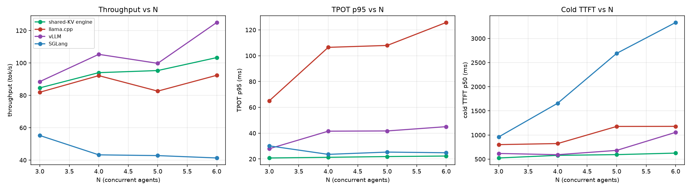
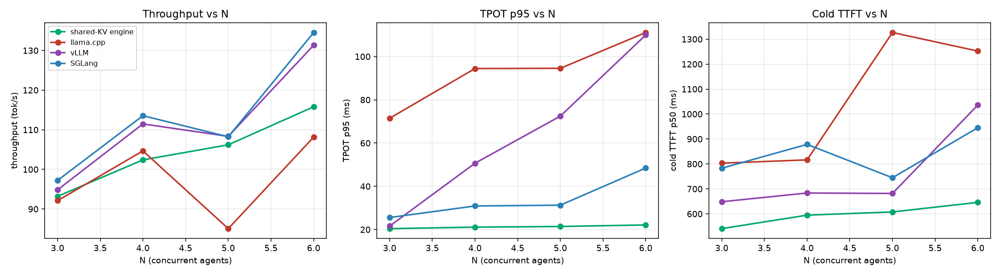
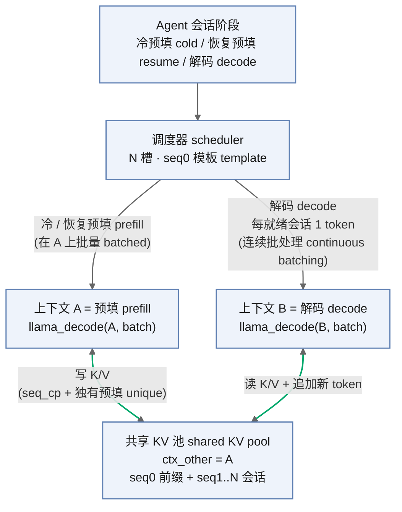

# OneKV

**在消费级 GPU 上为 agentic AI 做单引擎共享 KV 的 serving。**

[](LICENSE)


OneKV 是面向 agentic 负载（ReAct / Plan-and-Execute）的**单 GPU 推理 serving 引擎**。核心思想是
**在*一个引擎内部*做 prefill / decode 分离，同时共享一份 KV cache**——不做跨进程 KV 拷贝——这样
即使长 prefill 在跑，decode 延迟也能保持平稳。

它在消费级 GPU（RTX 3090）上以 Qwen2.5-3B / 7B 运行，并与 **llama.cpp / vLLM / SGLang** 在**相同
硬件、相同真实任务 trace** 上做四方对比。

---

## 亮点

- **单引擎 P/D 分离 + 共享 KV** —— 两个 `llama_context`（A = prefill，B = decode）共享一份 KV pool
  （`ctx_other = A`）；引擎之间不需要拷贝 KV。
- **连续批处理 + 前缀缓存** —— 在并发下保持 **TPOT p95 平稳**、**cold TTFT 低且平稳**（agent
  serving 的两个痛点）。
- **消费级 GPU 可用** —— RTX 3090、Qwen2.5-3B / 7B、~24 GB。
- **诚实、可复现的 4-way 基准** —— 同一套 harness、同一 trace、同一 `N`、串行测量。
- **同硬件比较** —— 结论是*相对*我们自己的基线，而不是论文的绝对数值。

> **范围：** 本项目衡量的是 **serving 性能**，不是智能体*质量*。模型是 Qwen2.5-**BASE**（无原生
> tool-calling），所以输出是计划式文本。

---

## 性能

### Qwen2.5-3B（4-way，N=3→6，tool_wait=0）

| Paradigm | Metric | OneKV engine | llama.cpp | vLLM | SGLang |
|---|---|---|---|---|---|
| **ReAct** | throughput (tok/s) | 149.8→175.2 | 131.1→145.0 | **167.7→222.8** | **164.2→226.3** |
| | TPOT p95 (ms) | **11.9→13.5** | 60.0→72.7 | 19.5→24.0 | 24.0→27.9 |
| | cold TTFT p50 (ms) | **308.6→367.6** | 439.5→737.8 | 302.7→621.4 | 302.2→454.8 |
| **P&E** | throughput (tok/s) | 162.5→192.2 | 145.1→147.7 | **170.4→259.1** | **179.5→243.1** |
| | TPOT p95 (ms) | **11.8→13.5** | 50.2→70.7 | 22.0→38.7 | 24.8→31.4 |
| | cold TTFT p50 (ms) | **316.5→383.8** | 412.3→773.2 | 343.0→603.4 | 335.0→478.2 |


### Qwen2.5-7B（4-way，N=3→6，tool_wait=0）

| Paradigm | Metric | OneKV engine | llama.cpp | vLLM | SGLang |
|---|---|---|---|---|---|
| **ReAct** | throughput (tok/s) | 84.6→103.3 | 81.9→92.4 | 88.8→123.6 | 90.3→125.2 |
| | TPOT p95 (ms) | **20.8→22.3** | 65.0→125.8 | 37.9→46.0 | 31.3→44.6 |
| | cold TTFT p50 (ms) | **524.2→625.0** | 800.6→1179.0 | 591.1→1214.5 | 590.5→958.6 |
| **P&E** | throughput (tok/s) | 93.2→115.8 | 92.1→108.1 | 94.8→131.3 | 97.2→134.5 |
| | TPOT p95 (ms) | **20.4→22.1** | 71.5→111.1 | 21.6→110.0 | 25.6→48.5 |
| | cold TTFT p50 (ms) | **540.9→646.0** | 803.2→1252.2 | 648.5→1036.0 | 782.8→945.2 |




### 结论

OneKV engine 是**延迟稳定性领先者**：

- **TPOT p95 平稳**（3B ~12–14 ms，7B ~20–22 ms）；llama.cpp 爆到 50–126 ms，vLLM/SGLang 升到
  20–110 ms。
- **cold TTFT 最低且基本平稳**（前缀缓存摊销；3B ~310–385 ms，7B ~520–650 ms），而所有基线都随 N 恶化。
- **吞吐不是它的强项**：`vLLM ≈ SGLang > OneKV > llama.cpp`。它用一点吞吐换 **TTFT/TPOT 稳定**——
  这正是 agent serving 的核心目标。

> **公平性说明。** vLLM/SGLang 用**足够的上下文**做基准（vLLM `--max-model-len 32768`，SGLang
> `--max-total-tokens 49152`）。之前 `--max-total-tokens 8192` 把 SGLang 的 KV pool 饿死，让它看起来
> 最差——那是 harness bug，不是 SGLang 的限制。一个上下文窗口扫描
> （[`docs/benchmark/methodology.md`](docs/benchmark/methodology.md) +
> [`figures/context-windows-n6.png`](figures/context-windows-n6.png)）显示：一旦上下文足够，每个后端
> 都在平台期，所以这些差距是真实的，不是配置造成的。

---

## 架构



- **A（prefill）**：把每个会话的*冷* prompt（共享 system 前缀只预填一次，再用 `llama_memory_seq_cp`
  复制到各会话）与 *resume* prompt（工具输出）打包成多序列 `llama_decode(A)`。
- **B（decode）**：连续批处理——每个 `llama_decode(B)` 每个就绪会话只解码 1 个 token，读 A 写入的
  KV 并追加新 token。
- `g_kv` 互斥锁只串行化 host 侧 cell 记账；两个 kernel 跑在不同 CUDA stream 上。

### 怎么让两个 context 共享一份 KV（难点）

llama.cpp 的单个 `llama_context` 不可重入，其 KV cache 也与它绑定。OneKV 给 llama.cpp 打了补丁
（见 [`patches/`](patches/)），使两个 context 共享一份 pool：

| File | Change |
|---|---|
| `llama-model.cpp` | Qwen 分支传 `mem_other` + share 回调 → decode 的 K/V 指向 prefill 的 K/V。 |
| `llama-context.cpp` | 把 `params.ctx_other` 传到 `cparams.ctx_other`。 |
| `llama-kv-cache.cpp` | `apply_ubatch` 允许镜像 context 写共享 cell；`seq_pos_min/max` 读共享 cell。 |
| `ggml-cuda-common.cuh` | `as_sidx()` 按当前 stream 索引绑定 cuBLAS handle/workspace/pool。 |

引擎源码：[`src/runtime/onekv_engine.cpp`](src/runtime/onekv_engine.cpp)。

---

## 安装

### 1. 硬件 / 系统
NVIDIA GPU（实测 **RTX 3090**，24 GB）、**CUDA 12.8**、Ubuntu 22.04。

### 2. 模型
四个产物（Qwen2.5-3B/7B × GGUF/HF）及其服务器路径 + SHA-256 见
[`configs/models/models.yaml`](configs/models/models.yaml)。

```bash
wget https://hf-mirror.com/hfd/hfd.sh && chmod a+x hfd.sh
apt update && apt install -y aria2
export HF_ENDPOINT=https://hf-mirror.com
export HFD_DOWNLOADER="aria2c -x 16 -s 16 -k 1M"
hfd Qwen/Qwen2.5-3B-GGUF --include "*qwen2.5-3b-f16*.gguf"   # GGUF (engine + llama.cpp)
hfd Qwen/Qwen2.5-3B                                          # HF safetensors (vLLM/SGLang + traces)
```

### 3. 打补丁并编译 llama.cpp
精确源码 / 编译选项 / 固定环境见
[`docs/setup/llama-cpp-patch.md`](docs/setup/llama-cpp-patch.md) 与
[`docs/setup/environment.md`](docs/setup/environment.md)。

```bash
cmake -DHF_ENABLED=OFF -DBUILD_UI=OFF -B build .
cmake --build build --target llama-cli llama-server
# 把 patches/ 里 4 个文件覆盖到对应源码，然后重编译
```

### 4. Python 包
```bash
pip install -e .   # requests, pyyaml, matplotlib, numpy, pytest
```

---

## 使用

```bash
# 生成统一的 12 任务 trace（ReAct / P&E 共用）
make trace

# 运行单引擎共享 KV 运行时（A = 并发智能体数）
make engine A=3

# 基线（自包含 multi-phase prompt）
make serve-llama A=3 S=12
make serve-vllm  A=3 S=12
make serve-sglang A=3 S=12

# 串行基准扫描（ReAct + P&E，N=3…6，一次只跑一个后端）
make sweep

# 画图
python scripts/plot_perparadigm.py      # per-paradigm 4-way（3B + 7B）
python scripts/plot_context_windows.py  # context-window 敏感度
```

---

## 可复现性

完整的服务器环境（硬件、CUDA、llama.cpp 版本 + 编译选项、模型 SHA-256、conda 版本）已固定在
[`docs/setup/environment.md`](docs/setup/environment.md)。每个后端都由同一套 harness、同一 12
任务集、同一 `N` 和 `tool_wait` 驱动，并且**串行测量**（一次一个后端，run 之间释放 GPU）。

---

## 文档

| Doc | Content |
|---|---|
| [`docs/design/architecture.md`](docs/design/architecture.md) | 系统 + 引擎 + 补丁设计。 |
| [`docs/design/paper-alignment.md`](docs/design/paper-alignment.md) | 设计决策与差异（相对已有工作）。 |
| [`docs/setup/environment.md`](docs/setup/environment.md) | 固定到字节级的环境（可复现）。 |
| [`docs/setup/llama-cpp-patch.md`](docs/setup/llama-cpp-patch.md) | 4 个共享 KV 补丁 + 编译/验证。 |
| [`docs/benchmark/methodology.md`](docs/benchmark/methodology.md) | workload、后端、指标 + context 公平性规则。 |
| [`docs/benchmark/results.md`](docs/benchmark/results.md) | 结果、图表、复现方法。 |
| [`docs/notes/known-limitations.md`](docs/notes/known-limitations.md) | 诚实边界 + 方法学坑。 |
| [`docs/notes/pitfalls.md`](docs/notes/pitfalls.md) | 服务启动 / 基准测试经验教训。 |
| [`results/`](results/) | 干净的 per-paradigm 4-way 表。 |
| [`REPORT.md`](REPORT.md) | 完整报告（设计、引擎、结果）。 |

---

## 诚实边界 / 局限

1. **绝对数值不可跨硬件比较** —— RTX 3090（82 SM）。我们始终与*自己的*、同 GPU、同 trace 的基线比较。
2. **未实现论文的 10 槽 green-context pool + TPOT 驱动的重绑定**。我们用**连续批处理**来达到
   "decode 保护"这一收益，实测在 3090 上做 SM 预留反而更差（见
   [`docs/design/paper-alignment.md`](docs/design/paper-alignment.md)）。
3. **BASE 模型，无原生 tool-calling** → 衡量的是 serving 性能，不是智能体质量。
4. **跨模型**：3B 和 7B 都用同一套方法学做基准；见上表。

---

## 许可证

MIT —— 见 [`LICENSE`](LICENSE)。
