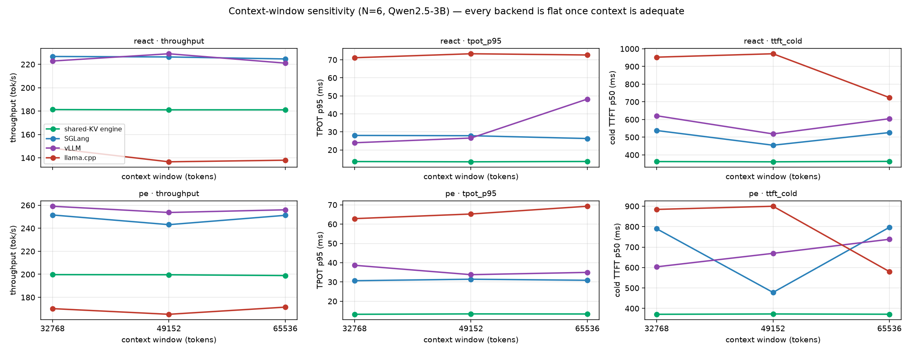

# Benchmark methodology

How the 4-way comparison is measured, and what "fair" means for the different backends.

## Workload

We generate **3-state agent traces** matching the paper's Table-I distribution using a
ToolBench-style agent loop:

- **States:** cold prefill (system + task prompt, 2.5–3.5 k tokens), resume prefill (tool output
  appended, ~30–127 tokens), decode (very short, ~27–99 tokens).
- **Paradigms:** ReAct (frequent resume prefills + short decodes) and Plan-and-Execute (long cold
  prefills + medium decodes).
- **Concurrency:** N = 3…6 concurrent agent sessions (12 sessions total).

A single **unified 12-task set** (`data/unified_tasks.json`) is shared by both paradigms; only the
prompt template and the token-count distribution differ. Generate with
`python scripts/gen_traces.py --config configs/trace-gen.yaml` (`--pool-file` reuses the same tasks).

## Backends (all on the same GPU + trace)

| Backend | Driver | Notes |
|---|---|---|
| llama.cpp (baseline) | `scripts/serve_llama.py` | llama-server, self-contained multi-phase prompt |
| vLLM | `scripts/serve_backend.py --backend vllm` | `--max-model-len 32768` |
| SGLang | `scripts/serve_backend.py --backend sglang` | `--max-total-tokens 49152` |
| **OneKV (this repo)** | `scripts/run_engine.sh` | single-engine shared-KV runtime |

Every backend is driven by the **same** harness: the same 12 sessions, same `N`, same `tool_wait`, same
EOS behaviour, and a **self-contained multi-phase prompt** (full conversation + previous model output
+ the phase delta) so prefix caching sees a coherent prefix.

## Metrics

- `TTFT_cold` — request arrival → first token after cold prefill.
- `TTFT_resume` — resume-prefill → first token after the append.
- `TPOT` — per-token decode latency (measured with per-token streaming; LLM kernels synced via
  `cudaDeviceSynchronize` / per-stream sync so wall-clock is meaningful).
- Throughput — decoded tokens / wall-clock.

Defined in `src/onekv/metrics.py` and `configs/metrics.yaml`.

## Context: the two different meanings of "context"

`context` is **not** the same concept across backends, which is the #1 source of unfair comparisons:

| Backend | Parameter | Meaning |
|---|---|---|
| vLLM | `--max-model-len` | **per-sequence** max (must be ≤ the model's native `max_position_embeddings`, e.g. 32768 for Qwen2.5-3B). |
| SGLang | `--max-total-tokens` | **total KV-cache pool** budget (per-sequence max comes from the model config). |
| engine | `n_ctx` | **KV pool** shared by all N sessions (no per-sequence cap). |
| llama.cpp | `context_length` | total pool, divided among `--parallel N` slots (per-slot = ctx/N). |

**Fairness = (a) no prompt truncates** (per-sequence max ≥ longest prompt ≈ 4.5 k tokens) **and
(b) the pool can hold N concurrent sessions** (pool ≥ N × ~4.5 k ≈ 27 k at N=6). All four backends
satisfy both with the parameters above. See [`../notes/pitfalls.md`](../notes/pitfalls.md) for the
SGLang `--max-total-tokens 8192` bug that starved its pool.

### Context-window sensitivity (empirical)

To confirm the comparison is fair, we swept the context window for **every** backend on the **same**
workload (N=6, Qwen2.5-3B, ReAct & P&E) and measured throughput, TPOT p95 and cold TTFT. The context
values are the backend's own parameter (vLLM `--max-model-len`, SGLang `--max-total-tokens`, engine
`n_ctx`, llama `context_length`); for the pool-based backends we also tested below the model's native
32768 to find the knee.

**ReAct (N=6)**

| backend | `32768` | `49152` | `65536` |
|---|---|---|---|
| engine thr/tpot/cold | 181 / 13.5 / 362 | 181 / 13.4 / 361 | 181 / 13.6 / 363 |
| sglang thr/tpot/cold | 227 / 28.0 / 538 | 226 / 27.9 / 455 | 225 / 26.3 / 526 |
| vllm thr/tpot/cold | 223 / 24.0 / 621 | 229 / 26.6 / 519 | 221 / 48.2 / 605 |
| llama thr/tpot/cold | 148 / 71.2 / 953 | 137 / 73.4 / 972 | 138 / 72.7 / 724 |

**P&E (N=6)**

| backend | `32768` | `49152` | `65536` |
|---|---|---|---|
| engine thr/tpot/cold | 200 / 13.2 / 371 | 200 / 13.4 / 373 | 199 / 13.4 / 372 |
| sglang thr/tpot/cold | 252 / 30.6 / 790 | 243 / 31.4 / 478 | 251 / 30.9 / 797 |
| vllm thr/tpot/cold | 259 / 38.6 / 603 | 254 / 33.8 / 669 | 256 / 35.0 / 738 |
| llama thr/tpot/cold | 170 / 62.8 / 884 | 165 / 65.2 / 900 | 171 / 69.3 / 580 |

(*thr* = throughput tok/s, *tpot* = TPOT p95 ms, *cold* = cold TTFT p50 ms.)

**Result — every backend is on a plateau once the context is adequate** (≥ ~27 k for N=6):
- **Throughput is flat** across `32768/49152/65536` for all four (engine ~181/199, SGLang ~225-251,
  vLLM ~221-259, llama ~137-172).
- So the cross-backend gaps are **real architectural differences**, not a context artifact:
  **throughput vLLM ≈ SGLang > engine > llama.cpp**; **TPOT p95 engine ~13 ms < SGLang ~26-31 <
  vLLM ~24-48 < llama ~63-73**; **cold TTFT engine ~360-373 ms (lowest) < vLLM/SGLang ~450-800 <
  llama ~580-970**.

Data: [`metrics/context_windows/n6_ctx_windows.json`](../../metrics/context_windows/n6_ctx_windows.json);
figure: [`scripts/plot_context_windows.py`](../../scripts/plot_context_windows.py).

## Measurement hygiene

- **Serial measurement:** one backend at a time; GPU freed between runs (`scripts/kill_gpu.py`).
- **Same workload across backends** — same sessions, `N`, `tool_wait`, EOS.
- **tool_wait** must be simulated by the engine too (per-session `wait_until` gate), otherwise its
  throughput is overstated.
- llama.cpp's `cache_prompt` **cannot** drive a multi-phase agent conversation, so we use a
  self-contained prompt instead.
