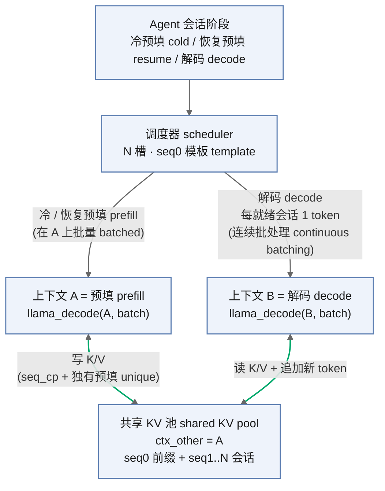
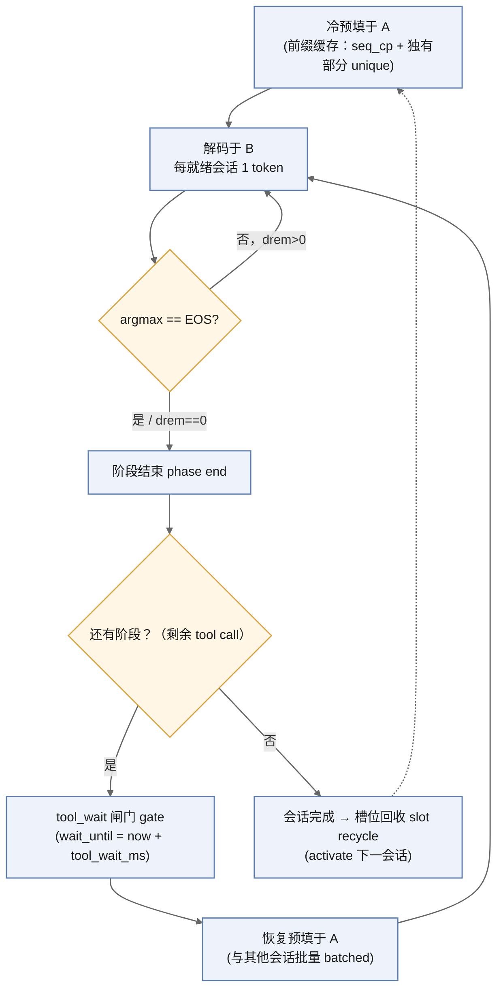

# 架构设计（Architecture）

本仓库复现 AgentServe 的**单引擎**部分：在一个引擎内做 **prefill/decode 分离（P/D disaggregation）**，
共享同一份 **KV cache**，并用**连续批处理（continuous batching）** 与**前缀缓存（prefix caching）** 驱动。

## 组件架构图

> 说明：`A` 负责**写**长序列的 K/V（冷预填 + 恢复预填），`B` 负责**读**共享 K/V 并**追加**每个新 token。
> 两条路径各跑在独立的 CUDA stream 上，`g_kv` mutex 只串行化主机侧的 cell 记账，`cudaEvent` 保证
> `B` 只读到 `A` 已写完的 K/V。

## 1. 跨上下文共享 KV（核心难点 the crux）

`llama_context` 不可重入，且其 KV cache 默认是私有的。我们 patch llama.cpp，让**解码上下文 `B` 共享
预填上下文 `A` 的 KV 池**：

- `llama_kv_cache` 本身已携带 `llama_kv_cache * other`、共享的 `v_cells_impl`（`shared_ptr`）和
  `layer_share_cb`。
- **`llama-model.cpp`**（Qwen 稠密分支）：把 `params.mem_other` 传给 KV cache，并传 `share` 回调
  （`il -> il`），使 `B` 的 K/V 张量指向 `A` 的。
- **`llama-context.cpp`**：让非特殊架构也能设置 `params.ctx_other` → `cparams.ctx_other`。
- **`llama-kv-cache.cpp`**：
  - `apply_ubatch`：去掉 `if (other) return;`，让解码上下文能把**自己的解码 cell** 写进共享池
    （否则镜像上下文只读不写）。
  - `seq_pos_min/max`：直接读共享 cell，而不是委托给 `other`。
- **`ggml-cuda/common.cuh`**：`as_sidx()` 按当前 stream index 给独立的 cuBLAS handle / workspace / pool
  建键，修复两个 stream 之间的 CUDA 资源冲突。

这样 `B` 可以**不拷贝**地读并追加到 `A` 的 KV，正是论文"避免跨引擎 KV 传输"的目标。

完整的 diff 见 [`../../patches/`](../../patches/)。

## 2. 预填/解码并发（P/D concurrency）

- 预填跑在 `pre` CUDA stream，解码跑在 `dec` CUDA stream。
- 每个会话一个 `cudaEvent` 来排序 GPU 工作，让解码等到该会话预填完成后再读。
- `g_kv` mutex 保护两个上下文之间的共享 cell 记账（find-slot / apply）。

## 3. 连续批处理（continuous batching）

解码线程不再逐会话解码，而是把**每个就绪会话的 1 个 token** 打包成一次 `llama_decode(B, batch)`。
这样摊销 kernel 启动、保持 SM 忙碌。预填同样把多个冷 prompt（或恢复 prompt）打包成一次
`llama_decode(A, batch)`。

## 4. 前缀缓存（prefix caching）

多个 Agent 会话共享一段很长的 system prompt。我们 tokenize 每个冷 prompt，找到公共 token 前缀，
先**预填一次**，再用 `llama_memory_seq_cp(0 → i)` 把这段 KV cell 共享给各序列；每个会话之后只预填
**自己独有的 instruction**。这把冷 TTFT 降到接近"独有 instruction 预填"的时间。

## 引擎入口与主循环（serving loop）

[`../../src/runtime/agentserve_engine.cpp`](../../src/runtime/agentserve_engine.cpp) 驱动完整流程：

1. 加载模型；创建 `A`（prefill）和 `B`（decode，`ctx_other=A`）。
2. 在 `A` 上批量冷预填（可选前缀缓存）。
3. 主循环：在 `B` 上批量解码；阶段结束时在 `A` 上调度恢复预填。
4. 记录每个会话/阶段的 `TTFT_cold`、`TTFT_resume`、`TPOT` 到 events JSONL。

> 测量上用 `cudaDeviceSynchronize`（或对应 stream 的 `cudaStreamSynchronize`）在 `llama_decode` 之后同步，
> 因为 llama.cpp 的解码是异步的；不同步会测出假时间。

## 阶段 / token 模型（phase / token model）

trace 每会话格式：`sid|cold_b64|d0|app1_b64|d1|app2_b64|d2|...`

- `cold_b64` — 冷（system + task）prompt。
- `dK` — 第 K 阶段的 decode token 数。
- `appK_b64` — 第 K 次恢复（tool output）追加到 prompt。

阶段索引 `i`：
- prefill 输入：`i==0 ? parts[1] : parts[1+2*i]`
- decode 数量：`parts[2+2*i]`
