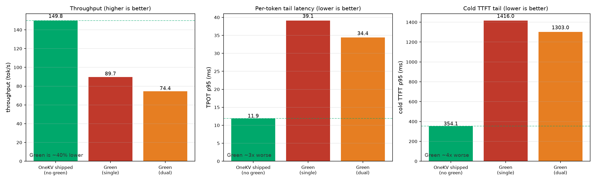

# Design alignment (vs. the reference serving design)

This is an honest, mechanism-by-mechanism comparison of OneKV against the reference
P/D-disaggregation serving design (arXiv 2603.10342): what aligns, what we did *differently*, and why.

## Paper mechanism (from §III)

| Mechanism | Paper | This repo |
|---|---|---|
| Single engine, shared KV | ✅ one engine, no inter-process KV copy | ✅ **reproduced** (two `llama_context`s sharing one KV pool via `ctx_other`) |
| Two dedicated CPU threads (Prefill / Decode) | ✅ | ✅ (stream separation + `cudaEvent`/mutex) |
| Prefill/decode disaggregation | ✅ | ✅ |
| Free resource isolation | CUDA **Green Context** SM partitioning | ⚠️ **continuous batching instead of SM reservation** |
| TPOT-driven `Rmin` rebinding across 10 green slots | ✅ | ➖ not implemented |
| Memory Manager (mutex + `cudaEvent`) | ✅ | ✅ (mutex over shared cells + `cudaEvent` ordering) |
| Prefix/context reuse | (KV cache reuse) | ✅ (system-prompt prefix caching) |

## What we reproduced faithfully

1. **Single-engine P/D disaggregation with a shared KV cache** — the paper's central contribution
   and the genuinely hard part. We show how to make llama.cpp share KV between a prefill and a
   decode context (see [`architecture.md`](architecture.md) and [`patches/`](../../patches/)).
2. **Two-stream concurrent P/D** with `cudaEvent` + mutex synchronization.
3. **Continuous batching** and **batched cold prefill** — the serving-side scheduling that the
   paper also exercises.

## Where we deviate, and why

### CUDA Green Context SM partitioning
The paper splits SMs so decode gets a reserved subset. We **measured** enabling Green Contexts in our
engine: because reserving SMs **constrains compute**, it is a **net negative** on this RTX 3090.
Compared to the shipped OneKV engine (no green), the green-context runs are worse on every axis:

| Metric (3B, N=3) | OneKV shipped (no green) | Green (single) | Green (dual) | Δ |
|---|---|---|---|---|
| throughput (tok/s) | **149.8** | 89.7 | 74.4 | ≈ −40% |
| TPOT p95 (ms) | **11.9** | 39.1 | 34.4 | ≈ **3× worse** |
| cold TTFT p95 (ms) | **354** | 1416 | 1303 | ≈ **4× worse** |

Our **continuous batching already protects decode** (TPOT p95 stays flat ~12–14 ms as N grows 3→6)
without paying the SM-reservation cost. So the shared-KV + continuous-batching path is **a better
alignment with the paper's goal** (stable decode, high throughput) than the literal Green-Context
mechanism on this hardware.

> The paper's Green-Context benefit is specifically about preventing a long prefill from starving
> decode. Continuous batching removes that starvation by separating the phases, so the SM
> reservation becomes redundant here.

### 10-slot green pool + TPOT-driven `Rmin` rebinding
Not implemented. The mechanism is orthogonal to the benefits we demonstrate (decode stability,
throughput), and adding SM constraints actively hurt the measured result.

## Reproduction facts

- **Paper hardware:** RTX A5000 (64 SM) and RTX 5090 (128 SM).
- **Our hardware:** RTX 3090 (82 SM), CUDA 12.8, Ubuntu 22.04.
- **Models in paper:** Qwen2.5-3B / 7B, LLaMA-3-8B.
- **Our model:** Qwen2.5-3B (F16, GGUF).
- **Baselines:** we compare against **our own** llama.cpp / vLLM / SGLang runs on the same GPU and
  trace, so comparisons are same-hardware and same-workload.

## Honest boundaries

1. **Cross-hardware absolute numbers differ** from the paper (A5000/5090 vs 3090). We always
   compare to *our* baseline, so relative conclusions (beat baseline) are valid; absolute numbers
   are not the paper's.
2. **The 10-slot Green Context pool + Rmin controller** are not reproduced. We replaced the
   benefit (decode protection) with continuous batching, which is cheaper here.
3. **Prefix caching is general**, but its cold-TTFT benefit depends on how much of the prompt is
   shared across sessions. With diverse-task traces (only ~87% shared system), the benefit is still
   ~2.4×; with identical prompts it is larger.

## What the paper does NOT require (and we deliberately avoid)

- Dual-engine / multi-process PD with KV transfer — the paper explicitly avoids this, and so do we.
- Any framework (vLLM, SGLang) in our engine — we call llama.cpp directly.
